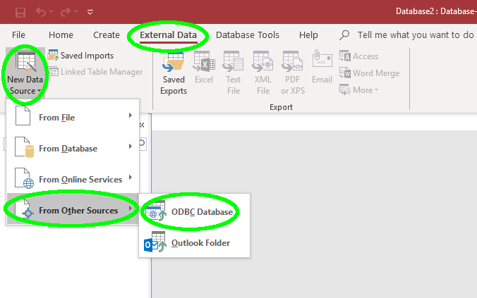
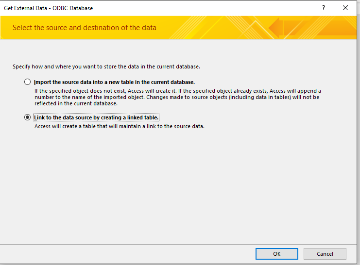
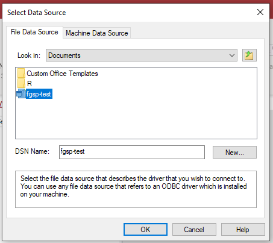
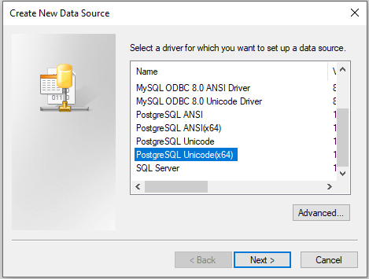
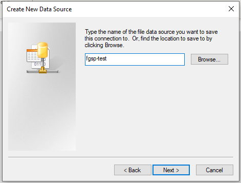
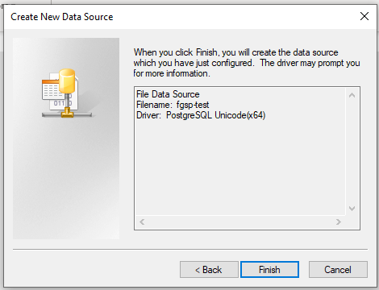
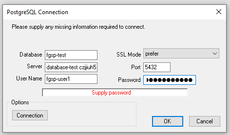
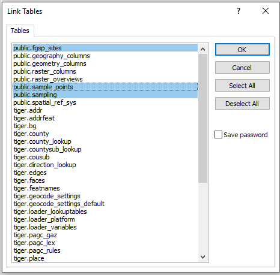

### Background
This document describes how to use Access to connect to a remote PostgreSQL database.

### Prereq: ODBC driver
In order for Access to communicate with other types of databases, you generally have to install a small ODBC driver specific to the type of database. For PostgreSQL, it can be downloaded here: https://www.postgresql.org/ftp/odbc/versions/msi/

Specifically, you want one for version 11 (version 12 of PostgreSQL is still pretty new and the spatial support isn't quite ready yet, so I'm using 11 for the database). Probably **psqlodbc_11_01_0000-x64.zip**, but if you are using an older 32 bit computer, then the **-x32** version.

### Access setup

##### Create blank database
First start by creating a blank database in access. If it creates a default empty table, go ahead and delete it.

##### Start external connection

##### Choose how to connect
You can choose to either download your own separate copy of the data from the database, or you can create links to the external tables that allow you to modify them.

##### Select the data source
You have to now select the database you want to connect to. This is setup using a DSN. You have two choices: connect to an already existing one, or set one up. A DSN file is included for convenience; just copy it to your documents directory, or somewhere else if you prefer. You can then navigate to it in the dialog shown in the image. Note: the DSN provided is for 64-bit machines; older machines may need to create a new 32-bit DSN.

##### Optional: Creating a DSN
First, you have select the driver you want to use. The selection shown in the image is ideal, but 32-bit machines may need to select the one immediately above it. Do not use one of the PostgreSQL ANSI options.

Assign it a name. Here I just use the name of the database, but it can be whatever you find most useful.

Just a confirmation dialog.

##### Enter connection details
This will be mostly filled out already if you use the premade DSN supplied or are using one you created before. Note that the database name here does matter, and should correspond to the actual database name.

##### Choose your tables
The highlighted tables are the ones I created and are what you want. Just ignore the others.

